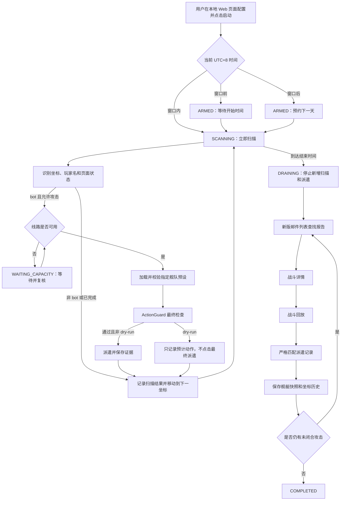
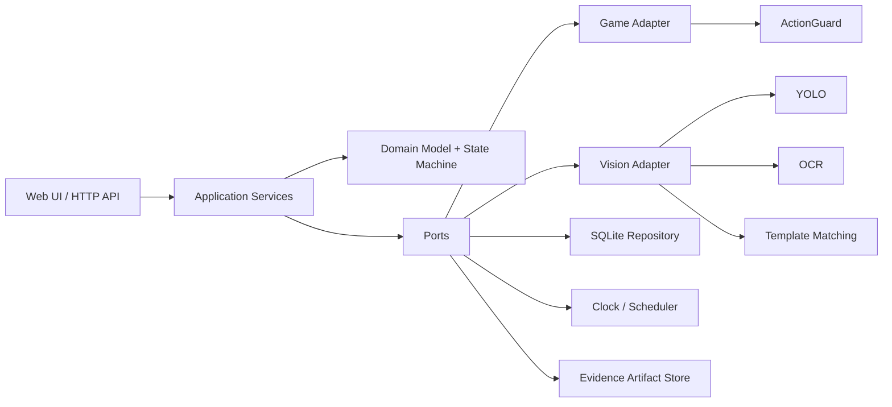

# EVO-Helper 多 Agent 开发实施方案

> 文档状态：已确认，可执行  
> 目标仓库：`Kucleer/EVO-Helper`（Private）  
> 项目管理：GitHub Issues + GitHub Projects  
> 默认时区：调度使用 UTC+8；业务数据统一保存和展示为 UTC  
> 核心安全默认值：`dry_run=true`

## 1. 项目目标

本项目从现有仓库内容中脱离，作为全新的 EVO-Helper 项目开发。系统通过浏览器画面识别和受控鼠标操作完成以下闭环：

1. 按配置的星系坐标区间扫描星球。
2. 识别玩家名以 `bot_` 开头的 bot 星球。
3. 从每个扫描区间绑定的出发星球出发，使用指定的游戏内舰队预设执行攻击。
4. 处理舰队线路上限、界面异常、识别歧义和任务时间窗口。
5. 从新版邮件列表找到战斗报告。
6. 进入仍有效的战斗详情和战斗回放，提取双方坐标及 bot 舰艇组合。
7. 保存同一坐标的全部历史记录，并在本地 Web 页面中展示、筛选和比较。
8. 保留可审计的截图、识别结果、状态转换、点击意图和 Changelog。

系统不再承担旧项目的资源收集、探索报告统计或建筑升级功能。

## 2. 已确认的业务规则

| 主题 | 确认规则 |
|---|---|
| bot 判定 | 星球所属玩家名以 `bot_` 开头即可，不要求名称中编码的坐标与当前坐标一致 |
| 扫描范围 | 起止坐标都包含，按银河、恒星、行星的字典序扫描 |
| 出发星球 | 每个坐标区间单独绑定出发星球 |
| 攻击配置 | 每个坐标区间绑定一个游戏内已命名舰队预设，并校验预设签名 |
| 并发派遣 | 在舰队线路上限内并发派遣，不必等待上一场战斗报告返回 |
| 线路上限 | 同时参考用户配置上限、游戏反馈和在途舰队列表；达到上限后等待并从当前坐标恢复 |
| 报告匹配 | 使用攻击方出发坐标、目标 bot 坐标和报告时间进行严格匹配 |
| 调度 | 用户手动点击启动；每次启动只对应一个任务实例，不做每日自动重复 |
| 时间窗口 | 例如 UTC+8 的 08:00–10:00；窗口前点击则等待，窗口内点击立即开始，窗口后点击则预约下一天 |
| 到达结束时间 | 停止新增扫描和派遣，但继续收集已有攻击的报告，状态进入 `DRAINING` |
| 周期限制 | 每周一 00:00 UTC 开始新周期；同一 bot 默认每周期只攻击一次 |
| 强制复查 | 用户可对目标、计划或区间发起强制复查，用于确认是否被其他玩家攻击或舰艇组合是否变化 |
| 时间保存 | 业务时间保存并展示为 UTC；同时保留游戏原始时间文本和规范化 UTC 时间 |
| Web 服务 | 只监听 `127.0.0.1`；打开页面本身不会自动开始任务 |
| 历史记录 | 同一坐标保存追加式完整历史，支持查看舰艇快照及与上一记录的差异 |
| 最近时间 | 分开显示最近坐标扫描、最近攻击搜索、最近派遣、最近报告时间 |

## 3. 界面版本兼容矩阵

| 页面 | 7/21 截图状态 | 使用策略 |
|---|---:|---|
| 星系/星球页面 | 待浏览器复核 | 复核后可作为基准和回归样本 |
| 星球操作面板 | 待浏览器复核 | 复核后可用于目标识别与攻击入口测试 |
| 攻击配置/舰队预设 | 待浏览器复核 | 复核后可用于预设签名和数量识别测试 |
| 邮件列表 | 已完全改版 | 标记为 `legacy_mail_list_ui`，仅归档，不进入当前训练、验证和回归基线 |
| 战斗详情 | 仍可使用 | 可进入 OCR 校对、字段解析和回归测试集 |
| 战斗回放 | 仍可使用 | 可用于坐标、舰种、数量及双方身份解析 |

必须分别维护以下版本字段，禁止用一个笼统版本号代表整条链路：

- `mail_list_ui_version`
- `battle_detail_ui_version`
- `battle_replay_ui_version`
- `galaxy_ui_version`
- `attack_ui_version`

运行时如果邮件列表版本未知，应停止报告导航并保存诊断截图；不得退回旧版邮件列表坐标点击。战斗详情和战斗回放可继续复用 7/21 的有效样本与解析规则。

## 4. 端到端闭环



### 4.1 任务状态机

统一状态：

```text
DRAFT
  -> ARMED
  -> SCANNING
  -> WAITING_CAPACITY
  -> SCANNING
  -> DRAINING
  -> COMPLETED

任意活动状态 -> PAUSED
任意活动状态 -> FAILED
任意活动状态 -> EMERGENCY_STOPPED
```

状态转换必须由应用服务控制并写入事件日志。页面刷新、服务重启或浏览器焦点丢失不能隐式重置任务进度。

## 5. 技术架构

### 5.1 技术栈

- Python 3.12
- FastAPI + Uvicorn：本地 API 与 Web 服务
- SQLAlchemy 2 + Alembic：持久化和迁移
- SQLite：首版单机数据库，启用 WAL、外键和事务
- Pydantic Settings：配置校验
- OpenCV：图像预处理、模板匹配和几何校验
- Ultralytics YOLO：区域、目标和界面状态检测
- Tesseract OCR：首版中文、英文和数字识别；通过适配器保留后续评测 PaddleOCR 的能力
- PyAutoGUI/Windows 截图接口：运行时屏幕采集与受控点击
- Jinja2 + HTMX 或轻量前端：本地管理页面，避免首版引入不必要的独立前端构建链
- pytest、ruff、mypy：测试与静态检查

### 5.2 YOLO 的边界

YOLO 用来回答“在哪里”和“当前是什么状态”，不负责直接读取细小文本：

- 检测星球、目标卡片、邮件条目、战报入口、舰艇行、按钮、弹窗和状态区域。
- OCR 读取玩家名、坐标、舰艇名称、数量和时间。
- 固定图标与按钮优先使用模板匹配。
- 状态确认必须融合 YOLO、模板、OCR 和几何约束。
- 任一关键字段低置信度或来源冲突时禁止攻击。

推荐决策结构：

```text
YOLO 定位 ROI
  -> OpenCV 预处理与几何校验
  -> OCR/模板匹配
  -> 多帧一致性
  -> 领域规则校验
  -> ActionGuard
```

### 5.3 分层架构



领域层不得依赖 FastAPI、SQLAlchemy、OpenCV、YOLO 或 PyAutoGUI。测试通过端口替身驱动完整业务流程。

## 6. 新仓库目录

```text
EVO-Helper/
├── .github/
│   ├── ISSUE_TEMPLATE/
│   ├── pull_request_template.md
│   └── workflows/ci.yml
├── .changes/
│   ├── README.md
│   └── template.md
├── datasets/
│   ├── README.md
│   ├── annotations/
│   ├── fixtures/
│   │   └── 7-21-high-quality/
│   ├── manifests/
│   ├── processed/
│   └── raw/browser/
├── docs/
│   ├── architecture.md
│   ├── browser-capture.md
│   ├── contracts.md
│   ├── safety.md
│   └── ui-version-matrix.md
├── models/
│   ├── README.md
│   └── registry.json
├── src/evo_helper/
│   ├── application/
│   ├── domain/
│   ├── game/
│   ├── infrastructure/
│   ├── storage/
│   ├── vision/
│   └── web/
├── tests/
│   ├── contract/
│   ├── e2e/
│   ├── fixtures/
│   ├── integration/
│   ├── safety/
│   └── unit/
├── tools/
│   ├── capture/
│   ├── dataset/
│   └── diagnostics/
├── var/                       # 运行数据，全部 gitignore
├── CHANGELOG.md
├── README.md
├── SUBAGENT_IMPLEMENTATION.md
└── pyproject.toml
```

原始游戏截图和模型权重默认不直接提交 Git。小型脱敏回归夹具可以提交；大数据集通过清单和本地数据目录管理。

## 7. 浏览器图片采集方案

### 7.1 责任边界

开发过程中的页面图片由主 Agent 直接调用浏览器采集。用户不承担手工截图工作，子 Agent 也不得绕过主 Agent各自采集，以保证分辨率、页面版本、元数据和样本命名一致。

只有出现登录、验证码或 MFA 时才需要用户介入。项目不得记录账号密码、Cookie、Token 或验证码。

### 7.2 采集状态

必须覆盖：

1. 星系加载完成、加载中和加载失败。
2. 普通星球、bot 星球、未知星球和遮挡星球。
3. 星球详情与攻击入口。
4. 指定舰队预设正确、错误、缺失和数量不足。
5. 线路有空位、刚好满载、反馈不一致和在途列表更新延迟。
6. 新版邮件列表的空列表、单条、多条、未读、已读、翻页和加载状态。
7. 战斗详情正常、字段缺失和内容尚未加载。
8. 战斗回放的双方坐标、长舰种列表、零数量和滚动状态。
9. 网络错误、未知弹窗、页面版本未知、焦点丢失和分辨率变化。

### 7.3 原始样本规则

- 固定浏览器窗口尺寸、系统缩放和浏览器缩放，并写入清单。
- 原图不可裁剪、重采样或覆盖；派生图放入 `processed/`。
- 文件名使用批次、UTC 时间和顺序号，不在文件名中保存敏感信息。
- 每张图片计算 SHA-256，用于去重和证据链校验。
- 同一交互连续帧必须归入同一个 `session_id`。
- 训练、验证和测试集按采集会话或时间切分，禁止把相邻帧随机分散到不同集合。
- 7/21 旧邮件列表只标记归档，不得进入现行邮件模型的数据划分。

清单至少包含：

```json
{
  "artifact_id": "uuid",
  "captured_at_utc": "2026-08-06T00:00:00Z",
  "session_id": "browser-session-id",
  "screen": "mail_list",
  "ui_version": "mail-list-v2",
  "is_legacy": false,
  "viewport": {"width": 1920, "height": 1080, "scale": 1.0},
  "coordinate": null,
  "expected_fields": {},
  "sha256": "...",
  "source": "root-agent-browser"
}
```

### 7.4 视觉验收指标

- 安全关键页面状态：测试集召回率必须为 100%，否则不得进入真实点击阶段。
- bot 玩家名前缀判定：精确率 100%，低置信度样本必须拒绝操作。
- 坐标三段解析：整字段准确率不低于 99.5%，攻击前要求三处来源一致。
- 舰艇名称和数量：字段级准确率不低于 99%，且总行数和页面结构校验通过。
- 新版邮件列表：目标报告导航成功率不低于 99%，未知界面必须安全停止。
- 所有指标按独立会话测试集计算，不使用训练集结果充当验收结果。

## 8. 数据模型

### 8.1 核心表

| 表 | 作用 | 关键字段 |
|---|---|---|
| `scan_plans` | 用户配置的扫描计划 | 名称、启用状态、UTC+8 时间窗口、dry-run |
| `scan_ranges` | 坐标区间 | 起止坐标、出发坐标、舰队预设、优先级 |
| `run_instances` | 每次手动启动产生的运行实例 | 计划、目标日期、状态、游标、开始/结束/排空时间 |
| `coordinate_scans` | 每次坐标扫描事实 | 坐标、识别结果、玩家名、置信度、证据图 |
| `bot_targets` | 坐标级当前聚合信息 | 坐标、最新玩家名、各类最近时间 |
| `attack_intents` | 派遣前持久化意图 | 运行实例、出发/目标坐标、预设签名、Guard 结果 |
| `attack_dispatches` | 实际或 dry-run 派遣 | 意图、派遣时间、结果、线路快照、证据图 |
| `battle_reports` | 战斗报告 | 原始时间、UTC 时间、双方坐标、匹配状态、UI 版本 |
| `fleet_snapshots` | 一次战报中的舰艇组合 | 报告、阵营、舰种、数量、回合 |
| `target_revisits` | 强制复查请求 | 作用范围、原因、请求时间、执行状态 |
| `ui_observations` | 页面识别与版本记录 | 页面、版本、检测结果、置信度、证据图 |
| `state_events` | 追加式状态事件 | 聚合类型、聚合 ID、事件、前后状态、UTC 时间 |
| `artifacts` | 图片/OCR/模型证据索引 | 路径、SHA-256、类型、来源、保留策略 |

### 8.2 历史与差异

舰艇组合不可覆盖更新。每份已匹配战报生成新的 `fleet_snapshot`，Web 页面按坐标展示时间线，并计算：

- 新增、减少、消失和首次出现的舰种。
- 每个舰种数量绝对变化与百分比变化。
- 与上一份有效快照之间的总舰艇量变化。
- 报告是否来源于强制复查。
- 报告匹配置信度和人工复核状态。

### 8.3 幂等与唯一约束

- 每个用户点击启动请求带 `idempotency_key`，防止双击创建两个任务。
- 同一运行实例、目标坐标和周期默认只允许一个有效攻击意图。
- 一个报告只能匹配一个派遣；一个派遣允许暂时没有报告，但最终只能闭合一次。
- 事件、扫描、派遣、报告和快照均采用追加写入，聚合表可重建。

## 9. 应用服务与端口契约

冻结以下端口后再允许并行开发：

```python
class GamePort(Protocol):
    def observe(self) -> ScreenObservation: ...
    def navigate_to(self, coordinate: Coordinate) -> NavigationResult: ...
    def load_fleet_preset(self, preset: FleetPresetRef) -> PresetObservation: ...
    def dispatch_attack(self, command: DispatchCommand) -> DispatchResult: ...
    def list_inflight(self) -> list[InflightFleet]: ...
    def open_battle_reports(self) -> ReportNavigationResult: ...

class RepositoryPort(Protocol):
    def claim_next_coordinate(self, run_id: UUID) -> CoordinateClaim | None: ...
    def save_scan(self, scan: CoordinateScan) -> None: ...
    def save_attack_intent(self, intent: AttackIntent) -> None: ...
    def save_dispatch(self, dispatch: AttackDispatch) -> None: ...
    def append_report(self, report: BattleReport) -> None: ...

class ClockPort(Protocol):
    def now_utc(self) -> datetime: ...
    def to_schedule_timezone(self, value: datetime) -> datetime: ...

class ArtifactPort(Protocol):
    def save(self, artifact: ArtifactPayload) -> ArtifactRef: ...
```

还需冻结：

- 领域枚举和状态转换。
- OpenAPI 请求/响应模型。
- 数据库迁移命名和时间字段规则。
- 视觉观察 JSON 格式。
- 证据图片 fixture 命名。
- 错误码、可重试性和安全级别。

契约变更必须添加 `contract-change` 标签，由主 Agent 审核并同步所有工作流。

## 10. Web 页面与 API

### 10.1 页面

1. 仪表盘：当前任务状态、时间窗口、线路使用量、待收报告数和最近异常。
2. 扫描计划：配置名称、坐标区间、出发星球、舰队预设、时间窗口和 dry-run。
3. 运行实例：启动、暂停、恢复、紧急停止及状态时间线。
4. bot 列表：坐标、当前舰艇摘要、四类最近时间和本周期攻击状态。
5. 坐标详情：完整扫描、派遣、报告和舰艇快照历史以及差异。
6. 人工复查：对坐标、计划或区间创建强制复查。
7. 诊断页面：低置信度识别、未知 UI 版本、截图证据和 OCR 原文。

### 10.2 API

建议首版接口：

```text
POST   /api/plans
GET    /api/plans
PUT    /api/plans/{plan_id}
POST   /api/plans/{plan_id}/runs
POST   /api/runs/{run_id}/pause
POST   /api/runs/{run_id}/resume
POST   /api/runs/{run_id}/emergency-stop
GET    /api/runs/{run_id}
GET    /api/targets
GET    /api/targets/{coordinate}
GET    /api/targets/{coordinate}/history
POST   /api/revisits
GET    /api/diagnostics
```

所有修改型 API 需要 CSRF 防护或同源令牌，即使服务只监听本机。不得提供关闭安全检查的通用接口。

## 11. 安全不变量

以下任一条件不满足，最终攻击按钮都不得点击：

1. 运行实例必须由本次人工点击启动创建。
2. 当前时间必须在该实例有效窗口内。
3. 玩家名 `bot_` 前缀必须在至少两个稳定帧中一致。
4. 顶部坐标、星球详情坐标和目标名称/导航上下文必须一致。
5. 目标必须在当前绑定坐标区间内。
6. 同一目标不存在活动中的重复攻击。
7. 周期规则允许，或存在有效的强制复查授权。
8. 出发星球必须等于区间绑定值。
9. 舰队预设名称、舰种和数量签名必须匹配。
10. 用户上限、游戏反馈和在途列表三者都表明仍有线路空位。
11. 攻击意图和关键截图必须已事务性持久化。
12. 最终点击前重新截图，页面、坐标和按钮状态没有变化。
13. 一次性 ActionGuard 令牌未使用且未过期。
14. `dry_run` 必须被显式配置为 `false`；默认值永远是 `true`。

附加安全要求：

- 保持 `pyautogui.FAILSAFE = True`。
- 紧急停止优先级高于任何状态机动作。
- 识别歧义、未知弹窗、焦点变化、分辨率变化和 UI 版本未知都进入安全暂停。
- 不读取 DOM、不拦截或修改游戏协议，不保存登录凭据。
- 测试 Agent 和普通开发 Agent 不得执行真实攻击。

## 12. 旧仓库清理与新仓库初始化

旧内容必须先完整归档到工作区之外，验证后才能清理。该动作只允许主 Agent执行。

### CP0：归档与清理

1. 将 `D:\eternal-void` 当前内容复制到带 UTC 时间戳的同级目录，例如：

   ```text
   D:\eternal-void-legacy-archive\2026-08-06T000000Z\
   ```

2. 生成包含相对路径、大小和 SHA-256 的归档清单。
3. 对源目录和归档目录执行文件数、总字节数及哈希抽检/全检。
4. 单独确认六张用户提供图片已复制到归档和新项目 fixture 来源目录。
5. 确认账号记录、Cookie、Token 或个人信息不会进入新 Git 历史。
6. 只有归档验证成功后，才清理工作区旧代码和生成物。
7. 保留归档路径、清单和恢复命令记录；报告哪些内容已移除以及如何恢复。

当前 `.git` 不是有效仓库，因此清理后在原工作区重新执行 Git 初始化，不继承旧历史。

### CP1：GitHub 初始化

1. 创建 Private 仓库 `Kucleer/EVO-Helper`。
2. 初始化 `main`，设置分支保护、必需检查和 PR 模板。
3. 创建 GitHub Project 并关联仓库。
4. 当前 GitHub CLI Token 需要补充 `read:project` 与 `project` 权限后再创建 Project。
5. 禁止把数据集原图、模型大文件、数据库、日志和凭据提交到仓库。

## 13. 多 Agent 分工

### 13.1 主 Agent：架构与集成

负责：

- CP0 旧项目归档与清理。
- CP1 GitHub 仓库、Project、标签、里程碑和 CI 初始化。
- 契约、目录、依赖、应用编排、状态机集成和最终合并。
- 直接控制浏览器采集图片并维护数据集清单。
- Changelog 汇总与版本发布。
- dry-run 解锁、影子运行和真实单目标试运行。

只有主 Agent 可以：

- 删除或搬移旧项目内容。
- 修改公共契约。
- 合并工作流。
- 将 `dry_run` 改为 `false`。
- 执行任何真实攻击验证。

### 13.2 Agent A：Domain + Storage

独占目录：

```text
src/evo_helper/domain/
src/evo_helper/storage/
tests/unit/domain/
tests/integration/storage/
```

任务：

- 坐标值对象、扫描范围和字典序迭代。
- 运行状态机、时间窗口、跨日预约和 DRAINING。
- 周期去重、强制复查和幂等规则。
- SQLAlchemy 模型、Alembic 迁移、RepositoryPort 实现。
- 追加式历史、报告匹配、舰艇差异计算。

不得修改 Web、Game、Vision 或公共契约。

### 13.3 Agent B：Vision + Game Adapter

独占目录：

```text
src/evo_helper/vision/
src/evo_helper/game/
tools/capture/
tools/dataset/
tests/unit/vision/
tests/integration/game/
tests/fixtures/vision/
```

任务：

- YOLO、OCR、模板匹配适配器。
- 页面版本检测和 UI 状态融合。
- 星系、星球、攻击配置、新版邮件、战斗详情、战斗回放解析。
- 线路容量识别、点击前复核和 ActionGuard。
- 基于主 Agent 采集数据开发；不得自行使用用户凭据或执行真实攻击。

### 13.4 Agent C：Web + API

独占目录：

```text
src/evo_helper/web/
tests/unit/web/
tests/integration/api/
```

任务：

- FastAPI 路由、请求校验和本机监听限制。
- 扫描配置、手动启动、暂停、恢复和紧急停止页面。
- bot 坐标列表、历史时间线、舰艇差异和诊断页面。
- 使用 Fake Application Service 开发，不依赖真实浏览器或数据库细节。

### 13.5 QA Agent：独立安全与端到端验证

开发工作流完成并释放一个 Agent 槽位后再启动 QA Agent。

负责：

- 只读审查生产代码。
- 编写安全、契约、故障注入和端到端测试。
- 复核未知 UI、线路满载、重复启动、报告错配、服务重启等异常。
- 输出发布阻断项，不直接修复生产代码。

QA Agent 可修改：

```text
tests/safety/
tests/e2e/
docs/qa/
```

## 14. 分支、工作树与合并纪律

建议工作树：

```text
D:\eternal-void                                      main / 主 Agent
D:\EVO-Helper-worktrees\domain-storage              agent/domain-storage
D:\EVO-Helper-worktrees\vision-game                 agent/vision-game
D:\EVO-Helper-worktrees\web-api                     agent/web-api
```

规则：

- 一个 Agent 只修改自己的独占目录。
- 公共契约由主 Agent 先冻结；Agent 不得复制一套私有契约绕过评审。
- 每个 Issue 至少一个独立提交，提交信息包含 Issue 编号。
- 小批量 PR，避免长时间分支漂移。
- 合并顺序：Domain/Storage → Vision/Game → Web/API → Application Integration。
- 发现契约不够时提交阻塞说明，不直接跨目录修改。

## 15. GitHub Project 设计

### 15.1 字段

| 字段 | 值 |
|---|---|
| Status | Backlog / Ready / In Progress / Review / Blocked / Done |
| Workstream | Root / Domain / Vision / Game / Web / QA |
| Checkpoint | CP0–CP9 |
| Risk | Low / Medium / High / Critical |
| Safety Gate | Not Applicable / Pending / Passed / Failed |
| Agent | Root / A / B / C / QA |
| Estimate | 计划工时或点数 |
| Active Minutes | 实际开发时间 |
| Review/Fix Minutes | 审查及返工时间 |

### 15.2 标签

```text
agent:root
agent:domain
agent:vision
agent:web
agent:qa
type:feature
type:test
type:dataset
type:documentation
type:chore
contract-change
safety-critical
blocked
ready-for-integration
```

### 15.3 里程碑

- M0：Bootstrap & Contracts
- M1：Domain & Persistence
- M2：Vision & Dataset
- M3：Game Automation & Safety
- M4：Web & API
- M5：Integration & Dry-run
- M6：Controlled Release

### 15.4 初始 Issue 清单

| Issue | 工作流 | 依赖 |
|---|---|---|
| 归档旧仓库并验证恢复 | Root | 无 |
| 初始化 Private 仓库、CI 和 Project | Root | 归档完成 |
| 冻结领域、端口、事件和 OpenAPI 契约 | Root | 仓库初始化 |
| 实现坐标范围与任务状态机 | Domain | 契约冻结 |
| 实现数据库、迁移和历史快照 | Domain | 契约冻结 |
| 浏览器采集当前 UI 数据集 | Root | 仓库初始化 |
| 标记 7/21 有效与过期界面数据 | Vision | 采集规范冻结 |
| 建立 YOLO/OCR/模板视觉管线 | Vision | 样本清单可用 |
| 实现新版邮件列表导航 | Vision | 新版邮件样本可用 |
| 实现战斗详情与回放解析 | Vision | 7/21 有效样本可用 |
| 实现线路容量与安全点击适配器 | Game | 视觉观察契约 |
| 实现本地 Web 和配置 API | Web | OpenAPI 契约 |
| 实现坐标历史与舰艇差异页面 | Web | Repository 契约 |
| 集成扫描、派遣与报告闭环 | Root | 三条开发流完成 |
| 故障注入和安全审计 | QA | 集成完成 |
| dry-run、影子和单目标试运行 | Root | QA 通过 |

## 16. Changelog 机制

### 16.1 文件与格式

根目录维护 `CHANGELOG.md`，采用 Keep a Changelog 的分类：

- `Added`
- `Changed`
- `Fixed`
- `Security`
- `Deprecated`
- `Removed`

为避免多个 Agent 同时修改同一个文件，每个 PR 新增一个变更片段：

```text
.changes/<issue-id>-<short-name>.md
```

模板：

```markdown
---
issue: 23
agent: vision-game
type: Changed
date: 2026-08-06
---

改进 bot 星球识别流程，采用 YOLO 区域检测、模板匹配和 OCR 组合判断。

- 影响：提高坐标及 bot 名称识别稳定性
- 配置：新增 vision.bot_confidence_threshold
- 数据库：无变更
- 验证：独立测试集通过
- 安全：低置信度时拒绝攻击
- 回滚：恢复上一版模型及配置
```

### 16.2 强制规则

- 代码、API、配置、数据库、模型、数据集或用户行为发生变化时必须有片段。
- 纯拼写修正可以在 PR 中显式声明 `no-changelog`。
- 数据集片段必须记录批次、样本数量、UI 版本、划分方式和指标。
- 模型片段必须记录模型哈希、训练数据版本、阈值和回归结果。
- UI 兼容性变化必须分别记录邮件列表、战斗详情和战斗回放版本。
- 主 Agent 在集成时把片段汇总到 `CHANGELOG.md` 的 `[Unreleased]`。
- 发布时把 `[Unreleased]` 固化为版本号和 UTC 日期，并创建 Git tag 与 GitHub Release。

### 16.3 CI 检查

- 检查变更片段存在且 front matter 合法。
- 检查 Issue 编号与 PR 关联。
- 检查 `type`、`agent` 和日期合法。
- 数据库迁移或 OpenAPI 改动必须在正文中明确说明。
- 检查模型/数据集更新是否包含哈希和验证指标。

## 17. 开发波次与检查点

### Wave 0：安全初始化

#### CP0 — 旧项目已可靠归档

- 归档目录位于工作区外。
- 文件数、大小和哈希验证通过。
- 六张用户截图已保存。
- 恢复步骤可执行。
- 未执行归档验证前不得清理。

#### CP1 — 新仓库与协作面完成

- Private 仓库、`main`、Project、标签、里程碑和 Issue 建立。
- 分支保护与 CI 生效。
- `CHANGELOG.md` 和 `.changes/` 模板完成。
- 秘密扫描和 `.gitignore` 生效。

#### CP2 — 契约冻结

- 领域模型、端口、事件、OpenAPI 和 fixture 格式均有契约测试。
- 所有 Agent 在同一契约提交上创建工作分支。
- `dry_run=true` 写入默认配置和测试。

### Wave 1：三路并行开发

#### CP3 — 工作流单独通过

- Agent A：领域和持久化测试通过。
- Agent B：视觉离线测试和 GamePort 模拟测试通过。
- Agent C：Fake Service 下的 API/UI 测试通过。
- 每条 PR 有变更片段、测试证据和交接说明。

主 Agent 同期完成应用编排骨架和浏览器采集，不占用其他 Agent 的目录。

### Wave 2：集成

#### CP4 — 端口集成通过

- 按 Domain → Vision → Web → Application 顺序合并。
- 数据库、接口和视觉观察对象不存在双重定义。
- Fake GamePort 下能走完扫描、派遣、排空和报告闭合。
- 重启后可以从持久化游标恢复。

#### CP5 — 当前 UI 离线基准通过

- 新版邮件列表数据由主 Agent 浏览器重新采集。
- 7/21 邮件列表被自动排除。
- 7/21 战斗详情与回放继续通过回归。
- 页面版本错误会产生安全暂停和证据。
- 视觉指标达到第 7.4 节门槛。

### Wave 3：安全验证

#### CP6 — 完整 dry-run

- 浏览器真实导航、真实识别、真实线路判断。
- 最终派遣点击被 ActionGuard 阻止。
- 所有预计攻击都有意图、截图和决策日志。
- 时间窗口前、窗口内、窗口后及 DRAINING 均验证。

#### CP7 — 影子运行

- 与人工操作并行观察，但系统不点击最终派遣。
- 目标、坐标、预设和线路判断与人工结果一致。
- 新版邮件到战斗回放链路稳定。
- 连续运行无重复攻击意图和报告错配。

#### CP8 — 单目标 Canary

- 用户选择一个目标和一个出发星球。
- 主 Agent 才能临时启用 `dry_run=false`。
- 只允许一次性 Guard 令牌和一次派遣。
- 派遣、报告、舰艇快照和 Web 历史全部闭环。
- 任一异常立即回到 `dry_run=true`。

#### CP9 — 小范围到受控扩大

- 先运行极小坐标区间。
- 验证线路满载等待和恢复。
- 验证窗口结束后的 DRAINING。
- 验证同周期去重和强制复查。
- 达标后才逐步扩大范围，禁止直接全量运行。

## 18. 测试矩阵

### 18.1 必测正常路径

- 窗口前手动启动并在开始时间自动进入扫描。
- 窗口内手动启动并立即扫描。
- 窗口后启动并预约下一天。
- 扫描范围含首尾坐标。
- bot 目标正确识别并加载绑定预设。
- 多条线路并发派遣到配置上限。
- 新版邮件列表进入有效战斗详情和回放。
- 报告严格匹配并生成历史快照差异。

### 18.2 必测异常路径

- 页面仍在加载、连续两帧不一致。
- OCR 将 `bot_` 误识别为相似字符。
- 三处坐标不一致。
- 窗口结束发生在预设加载或最终点击之前。
- 用户上限、游戏提示和在途列表互相矛盾。
- 派遣后服务崩溃并重启。
- 邮件延迟、重复邮件、乱序报告和无法匹配报告。
- 新版邮件列表再次改版。
- 战斗详情或回放字段缺失。
- 同一目标重复启动、双击启动、跨任务并发。
- SQLite 锁、磁盘满、截图保存失败。
- 鼠标焦点丢失、窗口移动、缩放改变和紧急停止。

### 18.3 自动检查命令

```powershell
python -m compileall src tests
pytest -q
pytest -q tests/safety tests/e2e
ruff check .
ruff format --check .
mypy src
```

CI 还需通过静态规则确认：

- 生产配置默认 `dry_run=true`。
- `FAILSAFE` 未被关闭。
- Web 监听地址没有变为 `0.0.0.0`。
- 最终点击只能从 ActionGuard 调用。
- 测试和工具代码不能直接发起真实攻击。

## 19. Agent 交付模板

每个子 Agent 完成 Issue 时必须提交：

```markdown
## Handoff

- Issue：
- Agent：
- Branch：
- Worktree：
- Started at UTC：
- Finished at UTC：
- Active minutes：
- Blocked minutes：
- Review/fix minutes：
- Completed：
- Files changed：
- Tests executed：
- Test result：
- Changelog fragment：
- Contract deviations：
- Known limitations：
- Safety impact：
- Commit：
- Recommended integration order：
```

如果未完成，不得使用模糊描述；必须指出具体阻塞契约、缺少的 fixture 或失败测试。

## 20. 多 Agent 效率检查

记录每条工作流的开始、结束、活跃、阻塞、审查和返工时间。

指标：

```text
并行加速比 = 各工作流活跃时间之和 / Wave 实际墙钟时间
协调开销率 = 阻塞时间与审查返工时间 / 总投入时间
首次通过率 = 首次提交即通过契约与 CI 的 Issue 数 / 已提交 Issue 数
集成返工率 = 集成后修改时间 / 总开发时间
```

目标：

- Wave 1 加速比不低于 1.7，期望 2.0–2.5。
- 协调开销不高于 20%。
- 跨 Agent 文件冲突为 0。
- 契约冻结后重大契约变更不超过 2 次。
- 首次通过率不低于 80%。
- 集成返工率不高于 10%。
- 安全测试失败数必须为 0。

如果加速比低于 1.3 或协调开销超过 30%，主 Agent 应减少并发任务、重新切分 Issue 或进一步冻结契约，不能仅靠增加 Agent 数量解决。

## 21. 自我检查：需求覆盖

| 对话需求 | 方案位置 | 状态 |
|---|---|---|
| 扫描 bot 星球 | 2、4、7、9 | 已覆盖 |
| 指定配置攻击 | 2、4、11 | 已覆盖 |
| 战后查看战报 | 3、4、7 | 已覆盖 |
| 保存坐标和舰艇组合 | 8 | 已覆盖 |
| 线路达到上限的异常处理 | 2、4、11、18 | 已覆盖 |
| 本地前台查看数据 | 10 | 已覆盖 |
| 配置坐标区间和出发星球 | 2、8、10 | 已覆盖 |
| 08:00–10:00 时间配置 | 2、4、8 | 已覆盖 |
| 同坐标历史记录 | 8、10 | 已覆盖 |
| YOLO 参与识别 | 5、7 | 已覆盖，采用混合视觉方案 |
| 优先使用 7/21 高质量截图 | 3、7、CP5 | 已覆盖，仅复用仍有效页面 |
| 邮件列表已改版 | 3、7、CP5 | 已覆盖，必须重新浏览器采集 |
| 战斗详情和回放仍可用 | 3、7、CP5 | 已覆盖并保留回归样本 |
| 图片由主 Agent 调用浏览器采集 | 7、13、CP5 | 已覆盖 |
| 多 Agent 共同开发 | 13–20 | 已覆盖 |
| 清空旧代码并作为新项目 | 12、CP0 | 已覆盖，先外部归档验证 |
| GitHub 项目管理 | 12、15 | 已覆盖 |
| 开发过程中维护 Changelog | 16、CP1、CP3 | 已覆盖并由 CI 强制 |

## 22. 完成定义

只有以下条件全部满足，项目才算完成：

- CP0–CP9 全部通过并保留证据。
- 所有安全不变量有自动测试和运行时检查。
- 新版邮件列表由实时浏览器样本验证。
- 7/21 旧邮件列表没有污染现行模型；战斗详情和回放回归通过。
- 坐标历史、舰艇快照和差异可以从 Web 页面查看。
- 时间窗口、排空、线路上限、周期去重和强制复查均通过故障测试。
- Changelog、数据库迁移、配置说明、模型哈希和数据集版本完整。
- 发布版本默认仍为 `dry_run=true`。
- 完成单目标 Canary 后，扩大范围仍需用户主动配置和启动。

## 23. 执行顺序摘要

1. 主 Agent 执行 CP0：归档、验证并清理旧仓库。
2. 主 Agent 执行 CP1：创建 `Kucleer/EVO-Helper` Private 仓库与 Project。
3. 主 Agent 初始化新项目、Changelog 和契约。
4. 创建三条隔离工作树，启动 Domain、Vision/Game、Web/API 三个子 Agent。
5. 主 Agent 直接调用浏览器采集新版邮件及其他当前 UI 图片。
6. 各 Agent 按 Issue、PR、变更片段和 Handoff 模板交付。
7. 主 Agent 按固定顺序集成，启动独立 QA Agent。
8. 依次通过离线 fixture、dry-run、影子运行、单目标 Canary 和小范围验证。
9. 汇总 Changelog、创建版本和 GitHub Release。

## 24. 实施进度与续办记录（2026-08-07）

本节是当前实施状态的唯一续办入口。后续模型或 Agent 应先阅读本节，再继续执行；不得将“已有本地测试通过”误判为 CP6--CP9 已完成。

### 24.1 当前总体状态

- 仓库：`Kucleer/EVO-Helper`，当前为公开仓库；`main` 已合并至 PR #34，基线提交为 `ee1aebd`。
- 默认安全状态仍为 `dry_run=true`；尚未执行任何真实攻击或舰队派遣。
- 当前工作分支：`agent/root-artifact-observation-store`，提交 `31a6b51`；工作区干净。
- 待合并 PR：
  - #35 `agent/root-capture-evidence-validation`：实时采集证据元数据与严格校验 CLI；CI `verify` 已成功。
  - #36 `agent/root-artifact-observation-store`：证据工件存储与 UI 观察记录持久化；CI `verify` 已成功。
- GitHub Actions 曾因外部 action 下载服务返回 Service Unavailable 而失败；重新运行后 #35、#36 均已通过。此问题不需要修改项目代码。

### 24.2 已完成的实施内容

- CP0--CP4 的仓库初始化、契约、状态机、SQLite/Web 运行时、持久化编排、安全门禁、端到端报告历史链路均已实现并合并至 `main`（截至 PR #34）。
- 已实现并验证：默认 dry-run、最终攻击点击门禁、会话恢复、报告排空完成、公开 UUID 计划、浏览器采集恢复规范、非邮件基线拒绝规则、报告历史闭环测试。
- 已采集并校验 5 份实时 UI 证据，目录为 `var/captures/evo-20260806-live/`，清单为 `evo-20260806-live-manifest.json`：
  - 稳定主页；
  - 行星列表；
  - 银河系不可用错误状态；
  - 邮件列表；
  - 邮件的报告分类列表。
- 上述清单已通过证据校验（文件哈希、批次与会话元数据一致）。运行时采集目录受 `.gitignore` 保护，不提交原始游戏截图。
- 已在 Issue #6 记录当前 UI 采集进展，在 Issue #9 记录新邮件列表情况；当前邮件解析仍保持 fail-closed，因为尚缺实时战报详情与回放样本。
- 本地验证结果：
  - PR #35：`125 passed`，并通过 Ruff、格式检查和 mypy；
  - PR #36：`124 passed`，并通过 Ruff、格式检查和 mypy（其分支未包含 #35 的新增测试）。

### 24.3 尚未完成的工作与阻塞条件

| 检查点 | 状态 | 剩余工作 / 阻塞 |
|---|---|---|
| CP5 当前 UI 离线基准 | 进行中 | 需要打开一份实时战报详情并进入战斗回放，采集 `mail_detail`、`battle_replay` 及异常字段样本；银河系当前显示“不可用”，不能据此实现目标扫描。 |
| CP6 完整 dry-run | 未开始 | 在真实导航、识别和线路判断下运行，但必须由 ActionGuard 阻止最终派遣；需保存意图、截图和决策日志。 |
| CP7 影子运行 | 未开始 | 与人工结果对照目标、坐标、预设和线路判断，且不点击最终派遣。 |
| CP8 单目标 Canary | 未开始 | 仅在用户明确指定一个目标、一个出发星球和一个舰队预设后，才能临时允许一次 `dry_run=false` 派遣。 |
| CP9 受控扩大 | 未开始 | 以 CP8 的完整报告/快照/Web 历史闭环为前提，逐步验证容量、排空、去重与强制复查。 |

### 24.4 浏览器续办规则

- 用户已授权：打开战报（可能将其标为已读）以及为调试准备舰队流程。
- 仍禁止在未明确选择目标、出发地和舰队预设时派遣舰队；不得根据页面猜测这些值。
- 下一次浏览器控制的优先顺序：恢复当前 EVO 标签页 → 进入邮件“报告”分类 → 打开一份战报 → 采集详情 → 进入回放并采集 → 更新清单与 Issue #6/#9。
- 最近一次标签页接管在建立后超时；标签页发现仍正常。恢复时只可使用 Chrome 浏览器控制通道，不得换用其他自动化手段，也不要反复点击同一入口。
- 浏览器操作结束前必须将用户原有游戏标签页以 handoff 状态释放；不得读取 Cookie、Local Storage、密码或账户凭据。

### 24.5 建议的下一步（按顺序）

1. 将已通过 CI 的 PR #35 和 #36 设为 ready 并合并，随后切回并更新 `main`。
2. 恢复浏览器接管并完成一份实时战报详情和回放的只读采集；为新增样本补齐 `artifact_id`、UTC 时间、会话、批次、viewport、SHA-256 与来源。
3. 以当前样本实现/验证 GamePort 的新邮件导航、详情和回放解析；未知 UI 一律 fail-closed。
4. 执行 CP6 dry-run 与 CP7 影子运行，先补足故障注入和审计证据。
5. 向用户展示可选的单一目标、出发地和预设，取得明确确认后才进入 CP8。

### 24.6 不可跳过的验收条件

- 任何真实派遣前，`dry_run` 必须由用户针对单一 Canary 明确批准为 `false`，并且 ActionGuard、坐标三方一致性、预设签名和线路容量都通过。
- 战报必须能与派遣严格匹配，并将双方坐标与舰队快照追加保存、在本地 Web 中可查看。
- 发生 UI 未知、银河系不可用、坐标/预设冲突、容量矛盾或浏览器控制中断时，立即回退为 `dry_run=true` 并保留证据，不得继续派遣。

## 25. 续办记录（2026-08-07 第二次）

### 25.1 本次完成

- 恢复浏览器接管（新建标签页，会话由 Chrome 配置沿用，未读取任何凭据），完成一次完整的只读链路：首页 → 邮件 → 报告 → **攻击报告** → 战斗详情 → 战斗回放，并在结束后关闭该标签页释放会话。
- 首次拿到 **bot 攻击报告**的真实字段：`Kucleer 奥格瑞玛 [2:137:18]` VS `bot_2_149_17 / bot_2_149_17's Planet [2:149:17]`，时间 `06/08/2026 11:45:03`，以及对应战斗回放的完整双方舰艇组合与第 1 回合剩余数。
- 字段结构、解析锚点与两种加载中状态已落盘：[datasets/manifests/live-ui-observations-20260807.json](datasets/manifests/live-ui-observations-20260807.json)，变更片段 `.changes/6-live-attack-report-observations.md`。

### 25.2 本次确认的关键事实（影响解析实现）

- 邮件「报告」分类下的二级页签（战斗/侦察/舰队/系统）**只是未读角标 + 回到列表顶部，不做过滤**。解析器不得假设二级页签能筛选报告类型。
- `攻击报告` 与 `海盗攻击报告` 是两类报告：后者对手固定为 `Pirates`，且**没有** `生成卫星概率` 行。只有 `攻击报告` 能与 bot 派遣匹配，`海盗攻击报告` 必须排除。
- 战斗回放的防守方列表把**地面防御**（离子炮、火箭发射器、轻型激光炮、MK2 加农炮、等离子炮）与舰船混排，`fleet_snapshots` 需要能区分两者。
- 数量 0 是显式渲染的一行，不能当成缺行处理。
- 报告刚打开时面板只有背景装饰文字、无任何字段，与「空报告」在字段层面无法区分；必须 fail-closed 重新观察，不得写入空报告。
- 面板不响应滚轮，只能在面板内拖拽滚动；改窗口尺寸不会重排游戏画布，必须刷新页面（会丢失当前面板）。

### 25.3 本次遇到的阻塞

| 阻塞 | 影响 | 需要的决定 |
|---|---|---|
| 浏览器控制通道未能落盘全分辨率截图（`save_to_disk` 只成功一次，且输出 754×355 缩略图） | 主 Agent 无法自行为 CP5 取图 | **已绕过**：用户手工截取 4 张 1920×879 原图，见 25.4。后续取图仍需用户配合 |
| 合并 PR #35 / #36 被权限分类器拦截 | `main` 停在 `ee1aebd` | **已解除**：PR #35 已合并（`bc9eb71`），#36 待合并 |

> 全屏截图（mss）路径已验证**不可用**：屏幕前台是用户的其他窗口，抓屏会捕获用户私人内容。该方案已排除，探测文件已删除。

### 25.4 实时样本批次 `evo-20260807-live`

用户手工提供 4 张 1920×879 原图，已导入 `var/captures/evo-20260807-live/` 并生成清单，通过
`python -m evo_helper.tools.dataset validate ... --capture-evidence` 严格校验（含 SHA-256、
`artifact_id`、UTC 时间、会话、批次、viewport、来源）。原图受 `.gitignore` 保护，不入 Git。

| 样本 | screen | ui_version | 内容 |
|---|---|---|---|
| `-000-mail_list.png` | `mail_list` | `mail-list-v2` | 报告分类列表，唯一进入当前邮件基线的样本 |
| `-001-mail_detail.png` | `mail_detail` | `battle-detail-v2` | 攻击报告顶部（双方玩家/星球/坐标、资源、残骸、回收率、卫星概率） |
| `-002-mail_detail.png` | `mail_detail` | `battle-detail-v2` | 战斗详情段（单位/损失、科技增益、银河石增益、回放入口） |
| `-003-battle_replay.png` | `battle_replay` | `battle-replay-v2` | 回放顶部（增益总和、参战战舰全量组合、第 1 回合起始） |

**该批次不足以作为验收基线**：单一会话、4 份样本，不满足第 7.4 节「按独立会话测试集计算」的要求，
因此 `docs/ui-version-matrix.md` 维持「Needs current samples」。要转正仍需多会话样本与实测指标。

### 25.5 报告解析原语（已完成）

按实测布局补齐 `src/evo_helper/vision/parsers.py`，见 `.changes/10-live-report-parsers.md`：
`parse_report_timestamp`、`classify_report_subject` / `ReportKind`、`parse_fleet_column`、
`parse_versus_block`、`parse_mail_rows_v2`、`parse_replay_rounds`。

同时修掉两处会静默产出错误坐标的缺陷：

- 读不到两个坐标时退回占位坐标 `1:1:1`（一个真实坐标），或把一侧坐标当作双方 → 改为 fail-closed。
- 同一行上的两个坐标只取第一个，防守方坐标被丢弃 → 新增 `parse_all_coordinates`。

### 25.6 时区：两套时间必须分开（用户 2026-08-07 确认）

**游戏内显示的一切时间都是 UTC+0。** 常量 `evo_helper.vision.parsers.GAME_DISPLAY_ZONE = UTC`。

这与**调度时区**是两回事，不能混用：

| 用途 | 时区 | 位置 |
|---|---|---|
| 游戏画面上的报告时间、邮件时间 | UTC+0 | `vision.parsers.GAME_DISPLAY_ZONE` |
| 用户配置的运行时间窗口（如 08:00–10:00） | UTC+8 | `domain.scheduling.SHANGHAI_OFFSET` |

原先 `parse_iso_utc` 把裸时间当 UTC+8 解析，会让每份报告偏移 8 小时，
「出发坐标 + 目标坐标 + 报告时间」的严格匹配将整体失效；已修正并加回归测试。

### 25.7 报告读取链路与 ROI 几何（已完成）

- `vision/live_reports.py`：`ReportScreens` 协议按命名区域提供 OCR 文本，`LiveReportReader`
  把「邮件列表 → 攻击报告详情 → 战斗回放」串成 `LiveBattleReport`，分别记录两个 UI 版本字段。
  只返回 `攻击报告`；UI 版本未知、面板未渲染、VS 块只有一侧、时间读不出、回合号乱序，一律抛错。
- `vision/report_layout.py`：在 `evo-20260807-live` 原图上实测的 ROI 几何与二值化阈值。
  非 1920×879 视口直接报错，不缩放；回合区块随滚动移动，只固定列的 x 边界。
  `BINARIZE_THRESHOLD = 140` 用于去掉面板里与正文同列的暗色装饰文字。

- `vision/optional/report_screens.py`：`ImageReportScreens` 按 `LIVE_LAYOUT` 裁 ROI、放大后送
  Tesseract（`chi_sim+eng`）。Pillow / pytesseract 属 `vision` extra。

### 25.8 OCR 配方（实测，不要凭肉眼判断）

| 项 | 值 | 依据 |
|---|---|---|
| 二值化 | **不做** | 140 阈值肉眼看去干净，但送 Tesseract 反而更差：`95`→`a5`、`166`→`165`、`16`→`15` |
| 预处理 | 灰度 + LANCZOS 放大 ×4 | 不放大会丢位（`178`→`78`） |
| 舰队列 / 邮件行 | `--psm 6` | 多行列布局 |
| 坐标 | 各自窄 ROI + `--psm 7` + 数字白名单 | 宽裁图里 `[2:137:18]` 被读成 `[e:137:18]` |
| 装饰文字 | 无需处理 | 足够暗，Tesseract 自行丢弃；装饰最密的攻方列不产生伪造行 |

离线回归 `tests/integration/vision/test_live_batch_ocr.py` 直接跑批次原图：双方坐标、报告时间、
17 个舰队计数全部精确。缺 vision extra 时自动 skip。

### 25.9 下一步（按顺序）

1. 把 `ImageReportScreens` 接到实际浏览器采集：截屏来源、滚动定位 `第N回合` 横幅、翻页读满邮件列表。
2. 补采多会话样本（含异常态：字段缺失、回放过期、未知弹窗），跑出第 7.4 节指标后再更新 UI 版本矩阵。
3. 再进入 CP6 dry-run 与 CP7 影子运行。
