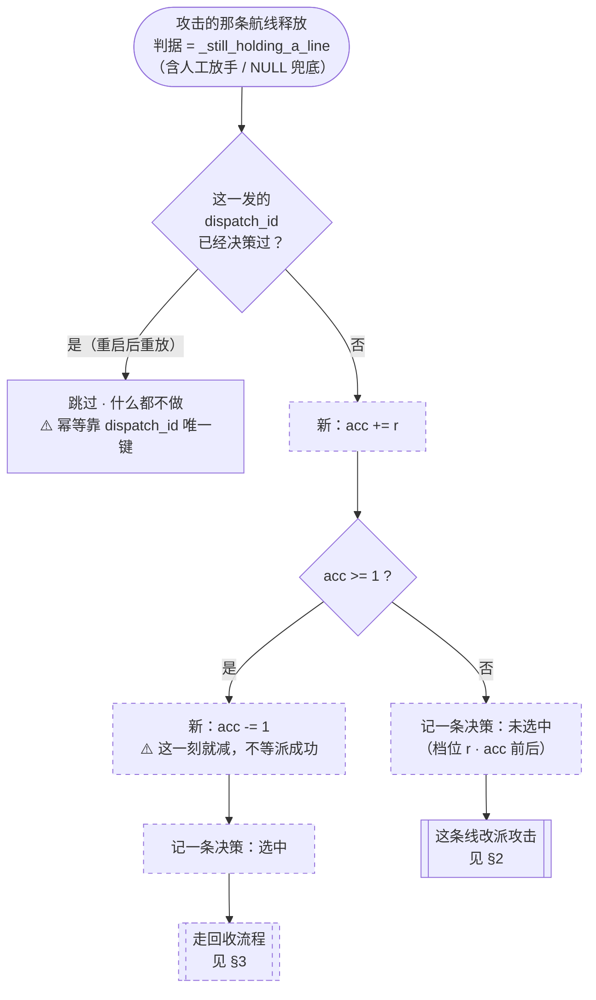
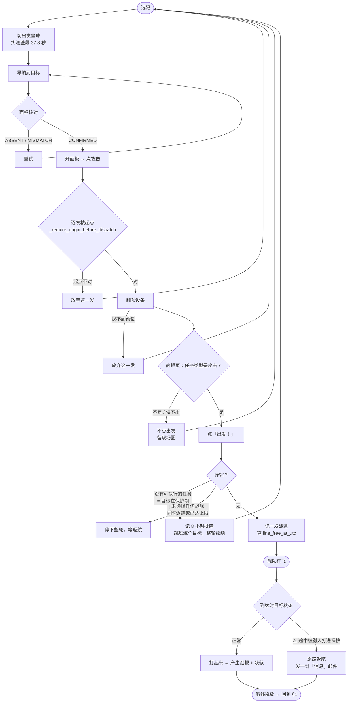
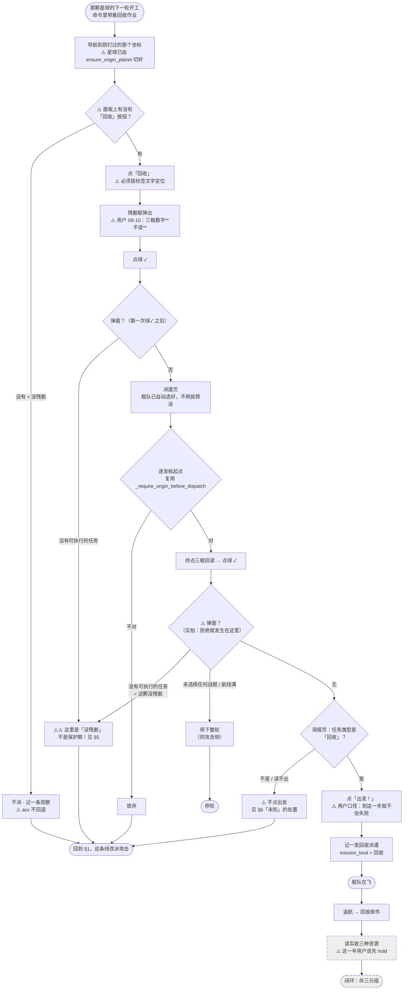
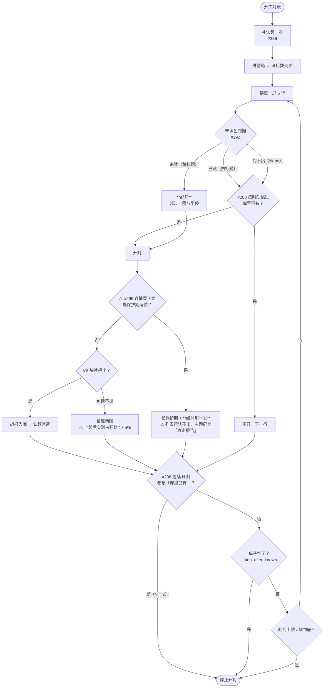

# 改版后的攻击 + 回收流程（v2，2026-09-10）

> ## v2 变更（按 Codex review + 用户裁决）
>
> - **P1#1**：§1 主图先加计数后判资格、且全图没有 `acc -= 1` —— 已重画
> - **P1#2 / 用户裁决**：「派不派和战报没关系，不要进行耦合」⇒
>   **战报那两道资格闸整个删掉**，§1 因此大幅简化
> - **P2#6**：⚠️ 弹窗判定画错了位置 —— 我自己 09-08 的采样是在**第二次绿✓ 之后**
>   被拒的，而 v1 只在第一次绿✓ 之后检查。已补

配套：[`节奏滑块.md`](节奏滑块.md)（回收节奏的需求）· [`设计.md`](设计.md)

## 图例

    实线 / 白底    现在就在生产上跑着
    虚线 / 标「新」  这次要做，还不存在
    ⚠️            已知的坑或已登记的缺陷，正文里有对应编号

⚠️ **回收那一整条都还不存在。** 图里画出来是为了让你看清它插在哪、
以及它和现有分支怎么撞。

---

## 1. 主循环：一条线空出来之后

> ⚠️ **这张图画的是「决策」，不是「动作」。**
> 决策在**调度器** tick 里做；动作要等**那颗星球的下一轮**运行器起来才发生
> —— 中间隔着一次公平轮换。整段接线见 [`调度接线.md`](调度接线.md)。

### ⚠️ v1 在这里错了三处

| v1 | 为什么错 | v2 |
|---|---|---|
| 先 `acc += r`，再判「战报到了吗 / 有战损吗」 | 不合格的那些**已经把 acc 推高了**，而正文却说「acc 不动」 | 资格闸整个删掉，见下 |
| 全图**没有** `acc -= 1`，§3 表格却写「已在 §1 减过 1」 | 跨过阈值后会**不断触发** | 选中当场减 |
| 没有幂等 | 「空线」是**现算状态不是事件**，重启后同一发会**再数一次** | 按 `dispatch_id` 查重 |

### ⚠️ 战报那两道闸为什么删掉

用户 2026-09-10：**「派不派和战报没关系，不要进行耦合。」**

⇒ **航线释放就 `acc += r`，没有前置条件。**
「有没有残骸」由 §3 里**面板上那个回收按钮**回答 —— 那本来就是唯一可信的判据。

⚠️ 顺带：打到保护上返航的坐标**可能仍有旧残骸**（以前打的）。
v1 的战报闸会把它们挡掉、永远不去看；解耦之后反而收得到。

## 2. 攻击流程（现状，未改）

### ⚠️ 攻击流程里两个**已登记但没修**的缺陷

| # | 是什么 | 后果 |
|---|---|---|
| **待办六** | **燃料不足时派遣被记成成功** | runner 走完全流程、游戏收下操作，但舰队没起飞。`attack_dispatches` 记了一行，航线被算成占用，到点收不到战报 |
| **待办八/九** | 见 §4 的邮件侧 | — |

---

## 3. 回收流程（**全新，一步都不存在**）

### 回收流程的支路一览

| 分支 | 处置 | `acc` |
|---|---|---|
| 面板上没有「回收」按钮（没残骸） | 记观察、这条线改派攻击 | **不回退** |
| 点**第一次**绿✓（残骸框）后弹「没有可执行的任务」 | 同上，⚠️ **但绝不能写保护期排除**（§5） | **不回退** |
| 点**第二次**绿✓（派遣页）后弹「没有可执行的任务」 | 同上 —— ⚠️ **09-08 实拍就是在这一步被拒的**，v1 漏画了这个位置 | **不回退** |
| 任一处弹「未选择任何战舰 / 航线已达上限」 | **停下整轮**（同攻击侧） | 不回退 |
| 核起点不对 | 放弃 | 不回退 |
| 简报页读不出任务类型 | **不点出发**、记「未知」、不重派 | 不回退 |
| 简报页写的不是「回收」 | 同上 | 不回退 |
| 那颗星球没有空线 | 不派 | 不回退 |
| 派出成功 | 记派遣、占线 | 已在 §1 减过 1 |

⚠️ **所有支路都不回退 `acc`** —— 滑块管的是**尝试**的节奏，不是成功次数
（节奏滑块 §3.5）。`acc` 在 §1「选中」那一刻就已经减过了。

### ⚠️ 弹窗有两个位置，v1 只画了一个

09-08 实机采样走的是：残骸框绿✓ →（进了派遣页）→ **派遣页绿✓ → 才弹
「没有可执行的任务」**。也就是说**拒绝发生在第二次绿✓ 之后、进简报页之前**。

v1 只在第一次绿✓ 之后检查，按它实现的后果：
**正常的拒绝会被记成「简报类型未知」**，而且可能在弹窗还没关掉时就转回攻击。

⚠️ 现有攻击实现也是在这个位置先处理弹窗（`pirate_loop.py:2747`）——
**照着它做即可，不用另发明**。

⚠️ 转攻击之前必须：**关掉弹窗 → 退出派遣页 → 恢复导航状态**。

---

## 4. 邮件回读（现状 + 本周已上的四个改动）

### 本周四个改动落在图上的位置

| PR | 在图上 | 上生产 |
|---|---|---|
| `#292` 未读色 | M4 | ✅ 09-09 00:17 |
| `#296` 连续白开 | M14 | ✅ 09-09 21:01 |
| `#298` 现场图 webp + 限流 | M13 那条留图 | ✅ 09-09 21:01 |
| `#299` 保护返航详情页兜底 | **M9** | ✅ 09-10 09:47 |

---

## 5. ⚠️⚠️ 攻击与回收共用同一句中文 —— 最大的坑

同一句 **「没有可执行的任务」**，在两条链路上意思完全不同：

⚠️ **照搬现有分支的后果**：一颗完全打得了的 bot 被排出攻击候选池 8 小时，
**而页面和日志上都看不出异常**。

⚠️ 更麻烦的是「攻击被拒就地改回收」那条（`回收残骸/待办.md` §10）会让两者
**在同一个坐标、同一分钟内先后发生**。

⇒ **`_DIALOG_KINDS` 是封闭表，现在表达不了「同一句话在两条链路上含义不同」。
先改这张表的形状，再谈接线。**

---

## 6. 派遣成功的三态（用户 2026-09-09 定）

> 「派遣回收不会失败，前提是你确认的是派遣回收。」

⇒ **承重闸门是简报页那道类型闸，不是出发之后的弹窗识别。**

| 态 | 什么时候 | 处置 |
|---|---|---|
| **成功** | 简报页确认「回收」后点了出发 | 记一发派遣，占航线 |
| **拒绝** | 简报页之前被拒 | 记一条观察，**不记派遣、不占航线** |
| **未知** | 简报页读不出类型 | **根本不点出发**；记「未知」，**不重派** |

⚠️ 「未知」的处置是「**不点**」，不是「点了之后不知道结果」——
风险被前移到了简报页。

---

## 7. 请你重点看这几处

1. ✅ **§1 的战报耦合已按你的裁决删掉** —— 航线释放就计数，
   「有没有残骸」交给面板上那个按钮。
2. **§3 所有支路都不回退 `acc`**（`acc` 在 §1 选中时就减过了）——
   这决定滑块管「尝试」还是「成功」，你确认过，画出来再核一次。
3. **§3 R1「还在当前视图吗」** —— 我假设回收紧跟在那一发攻击之后，
   所以出发星球多半还在。⚠️ 但中间可能已经切走了，那就要再切一次（37.8 秒）。
   **要不要为此把回收排到「切星球之前」去凑一批，我没设计，等你定。**
4. **§4 M9 的位置** —— #299 把保护返航的判定放在**开封之后**。
   列表页其实有更早的信号（绿齿轮徽章 + 红底），能省一次开封（20.5 秒/封），
   但那要新标定一块 ROI，**这一版没做**。
5. **§5 那张表的形状** —— 这是回收上线前的硬阻塞。
