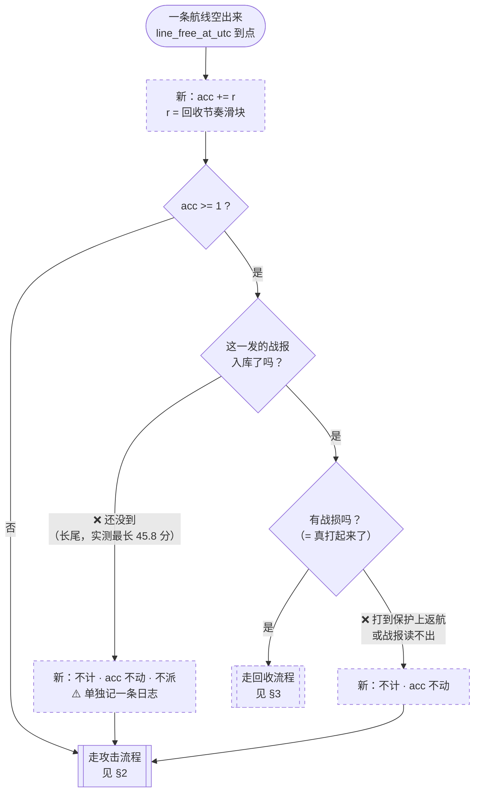
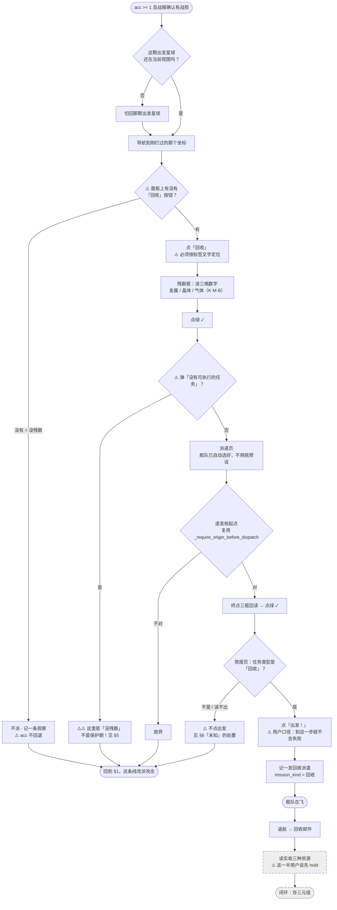
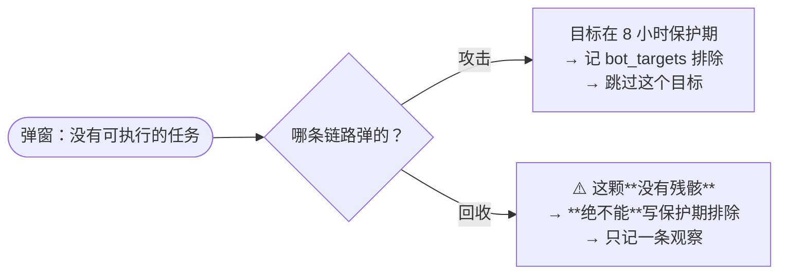

# 改版后的攻击 + 回收流程（待 review，2026-09-10）

配套：[`节奏滑块.md`](节奏滑块.md)（回收节奏的需求）· [`设计.md`](设计.md)

## 图例

    实线 / 白底    现在就在生产上跑着
    虚线 / 标「新」  这次要做，还不存在
    ⚠️            已知的坑或已登记的缺陷，正文里有对应编号

⚠️ **回收那一整条都还不存在。** 图里画出来是为了让你看清它插在哪、
以及它和现有分支怎么撞。

---

## 1. 主循环：一条线空出来之后

⚠️ **两条「不计」都不动 `acc`**（节奏滑块 §3.4）：不知道有没有残骸就不该排队，
否则分母被灌水、实际比例低于滑块上写的数。

⚠️ 和 §3 里那条「到了没残骸 → `acc` **不回退**」方向相反，**这是有意的**：
这里管「有没有资格进计数」，那里管「进了计数之后收没收到」。

---

## 2. 攻击流程（现状，未改）

### ⚠️ 攻击流程里两个**已登记但没修**的缺陷

| # | 是什么 | 后果 |
|---|---|---|
| **待办六** | **燃料不足时派遣被记成成功** | runner 走完全流程、游戏收下操作，但舰队没起飞。`attack_dispatches` 记了一行，航线被算成占用，到点收不到战报 |
| **待办八/九** | 见 §4 的邮件侧 | — |

---

## 3. 回收流程（**全新，一步都不存在**）

### 回收流程的支路一览

| 分支 | 处置 | `acc` |
|---|---|---|
| 面板上没有「回收」按钮（没残骸） | 记观察、这条线改派攻击 | **不回退** |
| 点绿✓ 后弹「没有可执行的任务」 | 同上，⚠️ **但绝不能写保护期排除**（§5） | **不回退** |
| 核起点不对 | 放弃 | 不回退 |
| 简报页读不出任务类型 | **不点出发**、记「未知」、不重派 | 不回退 |
| 简报页写的不是「回收」 | 同上 | 不回退 |
| 那颗星球没有空线 | 不派 | 不回退 |
| 派出成功 | 记派遣、占线 | 已在 §1 减过 1 |

⚠️ **所有支路都不回退 `acc`** —— 滑块管的是**尝试**的节奏，不是成功次数
（节奏滑块 §3.5）。

---

## 4. 邮件回读（现状 + 本周已上的四个改动）

### 本周四个改动落在图上的位置

| PR | 在图上 | 上生产 |
|---|---|---|
| `#292` 未读色 | M4 | ✅ 09-09 00:17 |
| `#296` 连续白开 | M14 | ✅ 09-09 21:01 |
| `#298` 现场图 webp + 限流 | M13 那条留图 | ✅ 09-09 21:01 |
| `#299` 保护返航详情页兜底 | **M9** | ✅ 09-10 09:47 |

---

## 5. ⚠️⚠️ 攻击与回收共用同一句中文 —— 最大的坑

同一句 **「没有可执行的任务」**，在两条链路上意思完全不同：

⚠️ **照搬现有分支的后果**：一颗完全打得了的 bot 被排出攻击候选池 8 小时，
**而页面和日志上都看不出异常**。

⚠️ 更麻烦的是「攻击被拒就地改回收」那条（`回收残骸/待办.md` §10）会让两者
**在同一个坐标、同一分钟内先后发生**。

⇒ **`_DIALOG_KINDS` 是封闭表，现在表达不了「同一句话在两条链路上含义不同」。
先改这张表的形状，再谈接线。**

---

## 6. 派遣成功的三态（用户 2026-09-09 定）

> 「派遣回收不会失败，前提是你确认的是派遣回收。」

⇒ **承重闸门是简报页那道类型闸，不是出发之后的弹窗识别。**

| 态 | 什么时候 | 处置 |
|---|---|---|
| **成功** | 简报页确认「回收」后点了出发 | 记一发派遣，占航线 |
| **拒绝** | 简报页之前被拒 | 记一条观察，**不记派遣、不占航线** |
| **未知** | 简报页读不出类型 | **根本不点出发**；记「未知」，**不重派** |

⚠️ 「未知」的处置是「**不点**」，不是「点了之后不知道结果」——
风险被前移到了简报页。

---

## 7. 请你重点看这几处

1. **§1 那两条「不计」** —— 战报还没到、以及打到保护上返航，都不进分母。
   这会让实际回收次数**低于**滑块设定，而我认为那是对的（不知道有没有残骸就不派）。
2. **§3 所有支路都不回退 `acc`** —— 这决定滑块管「尝试」还是「成功」，
   你上一轮确认过，这里画出来再确认一次。
3. **§3 R1「还在当前视图吗」** —— 我假设回收紧跟在那一发攻击之后，
   所以出发星球多半还在。⚠️ 但中间可能已经切走了，那就要再切一次（37.8 秒）。
   **要不要为此把回收排到「切星球之前」去凑一批，我没设计，等你定。**
4. **§4 M9 的位置** —— #299 把保护返航的判定放在**开封之后**。
   列表页其实有更早的信号（绿齿轮徽章 + 红底），能省一次开封（20.5 秒/封），
   但那要新标定一块 ROI，**这一版没做**。
5. **§5 那张表的形状** —— 这是回收上线前的硬阻塞。
